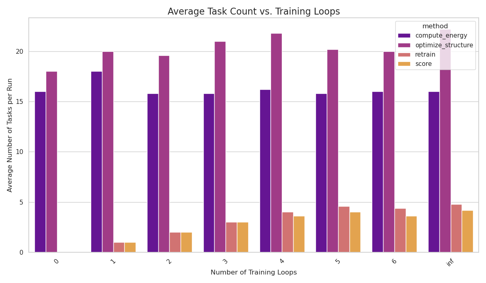

# ExaMol Experiment Summary

This report summarizes the results from the `experiment_results` directory.

## I. Average Task Performance (Aggregated)

The table and charts below show the average performance for each task type, grouped by the number of training loops performed.

|   training_loops | method             |   count |   total_compute_s |   avg_compute_s |
|-----------------:|:-------------------|--------:|------------------:|----------------:|
|                0 | compute_energy     |    16   |           24.2202 |          1.514  |
|                0 | optimize_structure |    18   |         1662.05   |         91.8978 |
|                0 | retrain            |     0   |            0      |          0      |
|                0 | score              |     0   |            0      |          0      |
|                1 | compute_energy     |    18   |           25.2152 |          1.4008 |
|                1 | optimize_structure |    20   |         1907.52   |         95.3758 |
|                1 | retrain            |     1   |           31.9028 |         31.9028 |
|                1 | score              |     1   |           50.8568 |         50.8568 |
|                2 | compute_energy     |    15.8 |           23.8222 |          1.5114 |
|                2 | optimize_structure |    19.6 |         1716.58   |         88.6428 |
|                2 | retrain            |     2   |           83.0242 |         41.5124 |
|                2 | score              |     2   |          137.29   |         68.645  |
|                3 | compute_energy     |    15.8 |           25.8992 |          1.652  |
|                3 | optimize_structure |    21   |         1734.72   |         82.9876 |
|                3 | retrain            |     3   |          119.612  |         39.8706 |
|                3 | score              |     3   |          211.832  |         70.6106 |
|                4 | compute_energy     |    16.2 |           19.2656 |          1.1882 |
|                4 | optimize_structure |    21.8 |         1890.83   |         87.2622 |
|                4 | retrain            |     4   |          137.576  |         34.3938 |
|                4 | score              |     3.6 |          176.875  |         48.7736 |
|                5 | compute_energy     |    15.8 |           20.2762 |          1.288  |
|                5 | optimize_structure |    20.2 |         1804.92   |         89.7574 |
|                5 | retrain            |     4.6 |          163.231  |         35.763  |
|                5 | score              |     4   |          174.101  |         45.3232 |
|                6 | compute_energy     |    16   |           19.767  |          1.235  |
|                6 | optimize_structure |    20   |         1790.02   |         89.6352 |
|                6 | retrain            |     4.4 |          160.749  |         36.2874 |
|                6 | score              |     3.6 |          177.533  |         49.9074 |
|              inf | compute_energy     |    16   |           19.4742 |          1.2124 |
|              inf | optimize_structure |    22.2 |         1850.88   |         83.9492 |
|              inf | retrain            |     4.8 |          153.337  |         31.8    |
|              inf | score              |     4.2 |          214.991  |         53.02   |

### Average Compute Time per Task vs. Training Loops

### Average Task Count vs. Training Loops

---

## II. Total Execution Time Analysis

### Average Total Execution Time vs. Training Loops

This chart shows the average wall-clock time for an entire run to complete for each training configuration.

### Breakdown of Average Total Execution Time by Method

This chart shows how the total execution time is distributed among the different task types.

